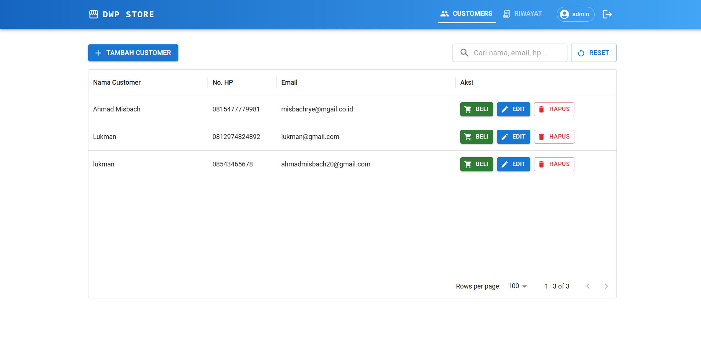
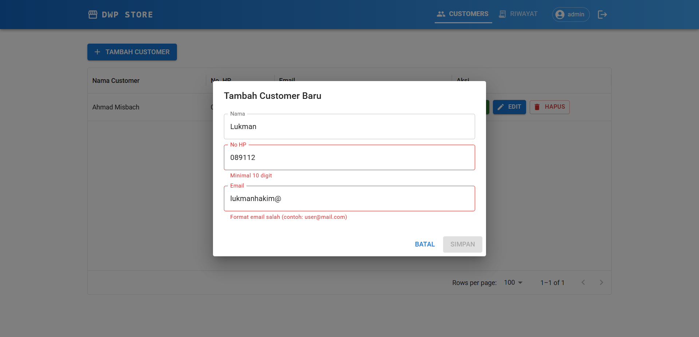
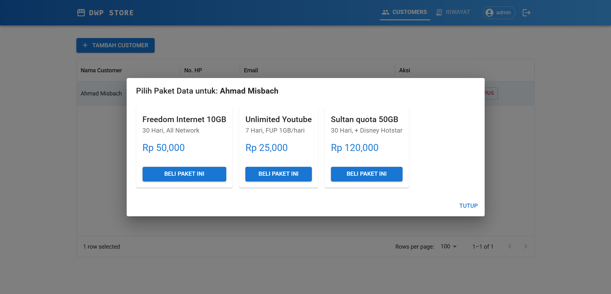
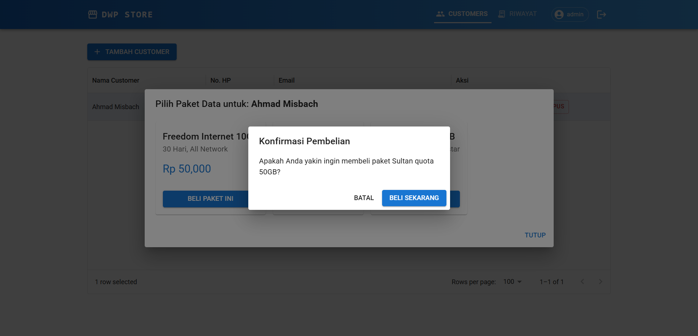
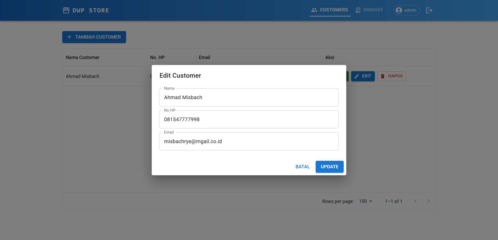
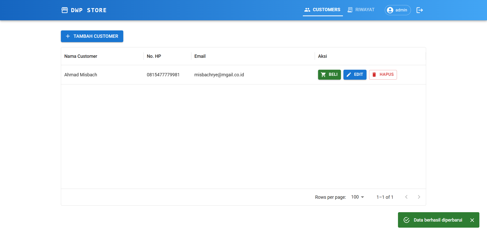
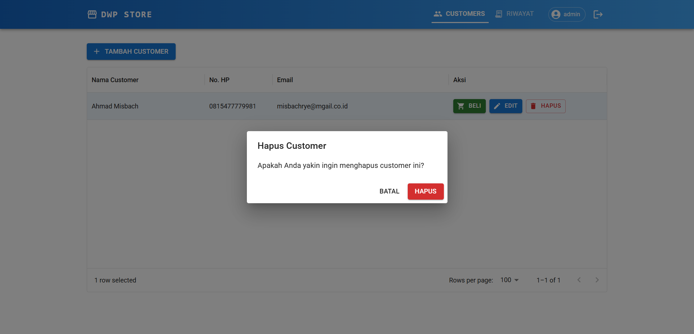
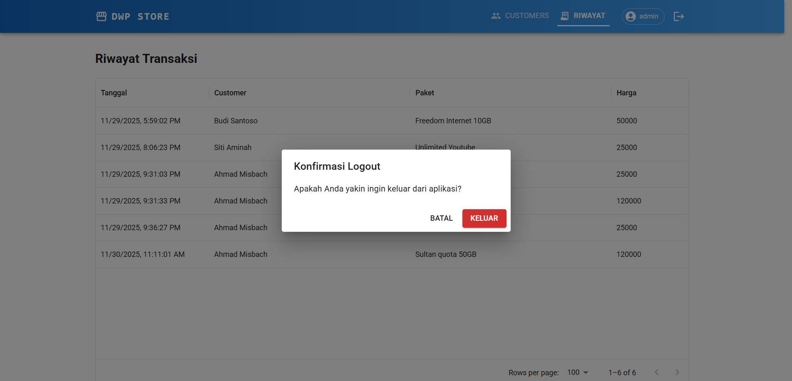

# DWP Data Store Application

Aplikasi web modern untuk manajemen pelanggan dan transaksi penjualan paket data. Project ini dibangun menggunakan **React (Vite)** sebagai frontend yang di-deploy di **Vercel**, dan **JSON-Server** sebagai backend REST API yang di-hosting di **Railway**.

## ⏱️ Estimasi Waktu Pengerjaan

Proyek ini diselesaikan dalam waktu kurang lebih **8-10 jam pada hari Sabtu, 29 November 2025 dan Minggu, 30 November 2025.**

## 🚀 Live Demo

* **Frontend (App):** [https://dwp-store.vercel.app/](https://dwp-store.vercel.app/)
* **Backend (API):** [https://dwp-store-production.up.railway.app/](https://dwp-store-production.up.railway.app/)

## 🌟 Tampilan Aplikasi (Screenshots)

Berikut adalah antarmuka utama dari aplikasi ini:

### 1. Halaman Login
*Halaman autentikasi untuk masuk ke dalam sistem.*


### 2. Dashboard / Manajemen Customer
*Menampilkan daftar pelanggan dan tombol aksi.*


### 3. Tambah Customer
*Interface untuk menambahkan customer baru.*


### 4. Transaksi Beli Paket
*Interface untuk memilih dan membeli paket data bagi pelanggan.*


### 5. Konfirmasi Transaksi
*Interface untuk mengonfirmasi pembelian paket data bagi pelanggan.*


### 6. Edit Customer
*Interface untuk mengedit data pelanggan.*


### 7. Sukses Edit Customer
*Interface untuk alert bahwa edit data pelanggan sukses.*


### 8. Hapus Customer
*Interface untuk menghapus data pelanggan.*


### 9. Riwayat Transaksi
*Interface untuk menghapus data pelanggan.*


### 10. Konfirmasi Logout
*Interface untuk mengonfirmasi sebelum logout.*


---

## 🚀 Instalasi dan Cara Menjalankan

Project ini membutuhkan dua proses terminal yang berjalan secara paralel (satu untuk Backend, satu untuk Frontend).

### 1. Clone Repository & Install Dependencies

```bash
# Clone repository ini
git clone [https://github.com/misbachrye/dwp-store.git](https://github.com/misbachrye/dwp-store.git)

# Masuk ke direktori project
cd dwp-test

# Install semua dependencies
npm install
```

### 2. Jalankan Backend (JSON Server)
Konfigurasi Frontend ke Lokal
Ubah file src/api/axiosInstance.js
```
// Comment bagian URL Railway, gunakan localhost
baseURL: 'http://localhost:3001',
```

Buka terminal pertama, lalu jalankan perintah berikut untuk mengaktifkan mock API pada port 3001:
```bash
npm run server
```

### 3. Jalankan Frontend (Vite)
Buka terminal kedua (tab baru), lalu jalankan perintah berikut untuk menjalankan aplikasi React:
```bash
npm run dev
```

## 🔐 Akun Demo
Gunakan kredensial berikut untuk masuk ke dalam aplikasi:
```bash
Username : admin
Password : password123
```

---

## 🌟 Fitur Utama

Aplikasi ini mencakup beberapa fungsionalitas utama:

1.  **Autentikasi Pengguna**:
    * Halaman login sederhana untuk staff/admin.
    * Proteksi rute (Private Routes) menggunakan React Context.
2.  **Manajemen Pelanggan (CRUD)**:
    * Menampilkan daftar pelanggan dalam tabel.
    * Menambah pelanggan baru dengan validasi input real-time.
    * Mengedit data pelanggan yang sudah ada.
    * Menghapus data pelanggan dengan dialog konfirmasi.
3.  **Transaksi Pembelian**:
    * Modal khusus untuk memilih paket data bagi pelanggan tertentu.
    * Integrasi data produk dari database.
    * Konfirmasi pembelian sebelum eksekusi.
4.  **Riwayat Transaksi**:
    * Mencatat dan menampilkan log histori pembelian yang telah berhasil dilakukan.
5.  **UI/UX Modern**:
    * Menggunakan **Material UI (MUI)** untuk tampilan yang responsif dan konsisten.
    * Feedback pengguna menggunakan Snackbar (notifikasi sukses/gagal).

---

## 🌟 Fitur & Pembaruan Terbaru

Aplikasi ini telah dikembangkan dengan fokus pada *User Experience (UX)* dan ketahanan sistem:

### 1. 🛡️ Robust Connection Handling (Auto-Retry)
* **Masalah:** Server backend (Railway) membutuhkan waktu 5-30 detik untuk "bangun" dari mode sleep (Cold Start).
* **Solusi:** Implementasi *Axios Interceptor* kustom yang otomatis melakukan request ulang (retry) jika server belum siap.
* **UX:** Menampilkan notifikasi realtime (Snackbar) kepada user: *"Server sedang mencoba menghubungkan... (1/3)"* agar user mengetahui sistem sedang bekerja, bukan error.

### 2. 🚦 Enhanced Feedback System
* **Loading States:** Indikator visual (Spinner/Linear Progress) saat Login, mengambil data transaksi, dan menyimpan data customer.
* **Validasi Real-time:** Form input customer memvalidasi format Email dan No HP secara langsung.
* **404 Not Found Page:** Halaman khusus yang ramah pengguna jika mengakses URL yang tidak valid.

### 3. 📱 Fitur Inti (CRUD & Transaksi)
* **Manajemen Customer:** Tambah, Edit, dan Hapus (Soft Delete/Hard Delete simulation) dengan konfirmasi keamanan.
* **Transaksi Pembelian:** Modal interaktif untuk memilih paket data berdasarkan Customer ID.
* **Riwayat Transaksi:** Pencatatan log transaksi lengkap dengan fitur Filter (Tanggal, Harga, Nama) dan Export CSV.

---

## 🛠️ Teknologi yang Digunakan

### Frontend (Vercel)
* **Core:** [React v19](https://react.dev/) + [Vite](https://vitejs.dev/)
* **UI Framework:** [Material UI (MUI) v7](https://mui.com/)
* **Routing:** React Router DOM v7
* **Data Fetching:** Axios (Custom Instance with Interceptors)
* **State Management:** React Context API (Auth)

### Backend (Railway)
* **Core:** JSON Server (Node.js)
* **Database:** `db.json`
* **Deployment:** Railway Web Service

---

## 📋 Prasyarat

Sebelum memulai, pastikan komputer Anda telah terinstal:

* [Node.js](https://nodejs.org/) (Versi 18 atau lebih baru disarankan)
* NPM (Node Package Manager)

---

## Struktur Project
```
dwp-store/
├── db.json                  # Database simulasi (Customers, Products, Transactions)
├── src/
│   ├── api/
│   │   └── axiosInstance.js # Config Axios dengan Auto-Retry Logic
│   ├── components/
│   │   ├── ConfirmDialog.jsx # Modal Konfirmasi Reusable
│   │   ├── Layout.jsx        # Navbar & Layout Utama
│   │   └── TableSkeleton.jsx # Loading Skeleton UI
│   ├── context/
│   │   └── AuthContext.jsx   # Global State Auth
│   ├── hooks/
│   │   ├── useCustomers.js   # Logic CRUD Customer
│   │   └── useTransactions.js # Logic & Filter Transaksi
│   ├── pages/
│   │   ├── CustomerPage.jsx       # Halaman Utama
│   │   ├── LoginPage.jsx          # Halaman Login
│   │   ├── TransactionHistory.jsx # Riwayat & Export CSV
│   │   ├── TransactionModal.jsx   # Proses Pembelian
│   │   └── NotFoundPage.jsx       # Halaman 404 Custom
│   ├── App.jsx              # Routing & Global Notification
│   └── main.jsx
├── vercel.json              # Konfigurasi Rewrite URL Vercel (SPA)
└── package.json
```